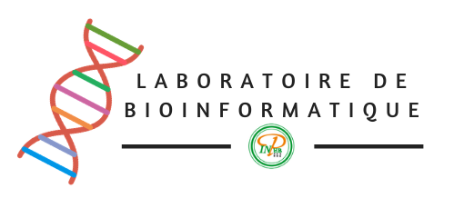

Le laboratoire [de]{.tiny} Bioinformatique [de]{.tiny} l'INPHB
================================================================================

Nous sommes un laboratoire de bioinformatique mettant l'accent sur la recherche en génomique, transcriptomique, microbiologie et pathologie des plantes, le développement de logiciels d'analyse et la formation en bioinformatique. Nous sommes engagé pour la transparence, la reproductibilité et l'open data. 


[L'Equipe]{.red}
================================================================================

::: member-cards
## Anicet Ebou


Bioinformaticien.

Anicet est obsédé par les données biologiques et leur analyse pour créer des systèmes innovants.

## Dominique Koua


Responsable du laboratoire

Dominique est docteur en bioinformatique, expert des sciences omics, de la venomique et est ingenieur agronome.
:::


[A Propos]{.blue}
================================================================================

```{r, include=FALSE}
lorem = "La compréhension profonde des sytèmes biologiques est primordiale pour l'avancé de la recherche en biologie. Les disciplines omiques, la microbiolgie, la médécine et toutes les disciplines biologiques sont devenues tributaires des données moléculaires qui offrent une plus grande compréhension. D'ou la nécessité de la bioinformatique. La bioinformatique est une domaine interdisciplinaire au service de la biologie."
```

```{r, include=FALSE}
ipsum = "La microbiologie"
```

```{r, include=FALSE}
micro = ""
```

## La bioinformatique pour l'avancement des sciences biologiques

<center>



</center>

`r lorem`


[Ce que nous faisons]{.pink}
================================================================================

## Microbiologie

- Analyse de données de séquencage (Illumina, IonTorrent)
- Classification taxonomique des microbres
- Profile fonctionnel des communautés microbiennes
- Développement d'outils d'analyses

## Génomique, transcriptomique

- Analyse des données génomiques ou transcriptomiques
- Classification et fonctions potentielles
- Etablissement de carte ontologique
- Développement d'outils d'analyse et d'automatisation

## Pathologie des plantes

- Analyse des données moléculaires des virus, ou tout autre organisme
- Caractérisation moléculaire
- Cartographie de la maladie
- Développement d'outils d'analyse

## Bio-développement

- Développement d'outils d'analyse de données biologiques
- Interface web d'analyse de données
- Application mobiles
- Applications et logiciels de laboratoires


[Bioinfo et OneHealth]{.green}
================================================================================

L’approche «Un monde, une santé» (OneHealth) s’applique à la conception et la mise en œuvre de programmes, de politiques, législations et travaux de recherche pour lesquels plusieurs secteurs communiquent et collaborent en vue d’améliorer les résultats en matière de santé publique. En effet, de nombreux microbes infectent aussi bien l’homme que l’animal, car ils vivent dans les mêmes écosystèmes. Les efforts d’un seul secteur ne peuvent prévenir ou éliminer le problème.

Pour parvenir a être plus efficaces, de nombreux professionnels aux compétences multiples, actifs dans différents secteurs tels que la santé publique, la santé animale, la santé végétale et l’environnement, doivent unir leurs forces à l’appui des approches «Un monde, une santé».

A cet effet la bioinformatique, se charge d’utiliser et de développer des outils d’analyse des données génomiques, structurales, protéomiques et des systèmes biologiques provenant des hommes, des plantes et des animaux pour faciliter la compréhension, l’analyse et le stockage des données biologiques. La bioinformatique joue donc le rôle de la «_biologie in silico_».

La bioinformatique joue donc un rôle centrale dans la compréhension des systèmes biologiques liés à la santé publique, animale, végétale et à l’environnement.

<center>


</center>

Les exemples les plus parlants sont ceux du Earth Microbiome Project (EMP) qui est un effort massif de caractérisation de la vie microbienne terrestre et du NIH Human Microbiome Project (NHMP) qui lui vise à caractériser le microbiome d’un homme en bonne santé en utilisant le séquençage 16S et la technique du shotgun. Ces projets ont déjà généré des centaines de milliards de séquences nucléotidique qui doivent être caractérisés, de façon écologique, microbiologique et moléculaire. Ces projets ont nécessité, dans l’esprit du OneHealth un effort de collaboration rarement vu notamment en bioinfomatique. Ces projets ont requis l’expertise bioinformatique pour faire face à ce déluge de données pour les analyser et permettre de caractériser les communautés microbiennes. Ainsi, la bioinformatique, en tant que acteur centrale dans ces projets (et donc dans le schéma globale du OneHealth) a contribué significativement à la mise en place du Protocole de conception des analyses microbiologiques du EMP et du NHMP, le développement de nouvels outils permettant de classer taxonomiquement les microbes, d’établir leur potentiels fonctions et leur impact sur leur environnement immédiats.


[Contacts]{.yellow}
================================================================================
<br>
<br>
<br>
Laboratoire de Bionformatique  
Ecole Supérieure d'Agronomie  
Institut National Polytechnique Felix-Houphouet Boigny  
Yamoussoukro, Côte d'Ivoire  
+225 49352291 / 48867275  